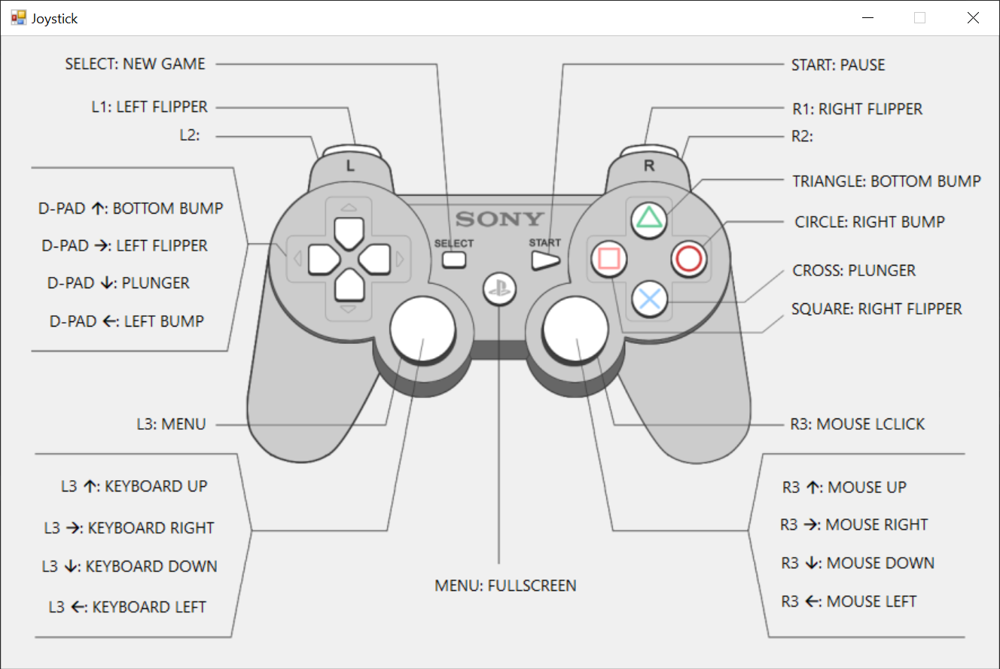

# joytokey-viewer
A joystick / gamepad viewer for JoyToKey - https://joytokey.net/en/

# Contributing
Pull requests and Issues are welcome!

If this project is useful to you, don't forget to leave a Github Star

You can also [Buy me a coffee](https://www.paypal.com/cgi-bin/webscr?cmd=_donations&business=SFM2FBMG9H9RQ&currency_code=USD) ☕

## Screenshots

## Requirements
Powershell 5+ - https://aka.ms/powershell

## Usage
1. Clone or download this repository
2. Open Powershell and navigate to the downloaded folder
3. Run `.\run.ps1 joystick $profile $config` where:
  - `$profile = profile name inside joysticks folder (e.g. dualshock)`
  - `$config = path to joytokey configuration file (e.g. c:\joytokey\game.cfg)`

## Options
- You can change the settings for a profile or create a new one
- A profile is defined by 3 files inside `.\joystick` folder: `profile.map`, `profile.ini` and `profile.png`
- `.\joysticks\profile.map`: buttons names
- `.\joysticks\profile.ini`: buttons positions
- `.\joysticks\profile.png`: background image
- When you move the texts with the mouse, their positions are automatically persisted to `.\joysticks\profile.ini`
- If you want customized text for the buttons, just set the comment column inside joytokey
